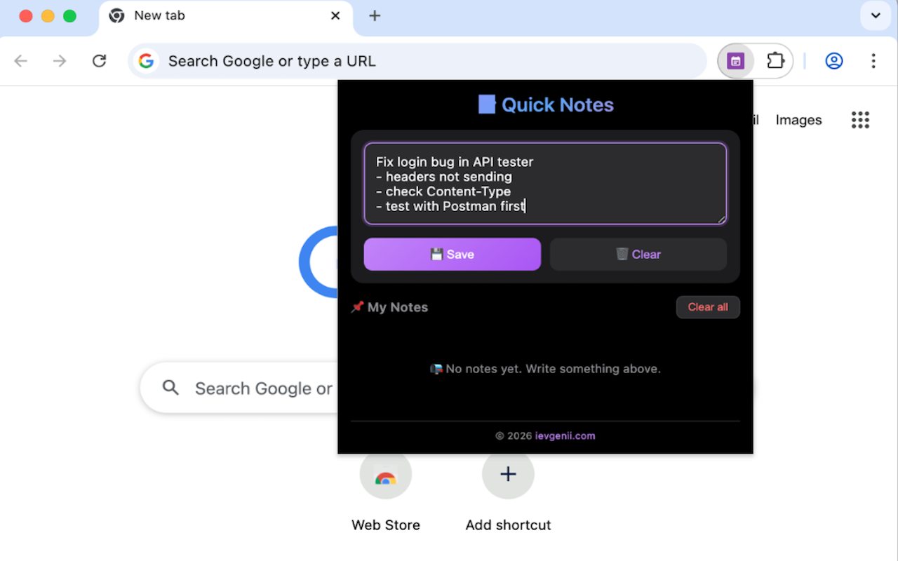

# 📝 Quick Notes

[](https://github.com/ievgeniipodovinnikov/quick-notes/blob/main/LICENSE)
[](https://github.com/ievgeniipodovinnikov/quick-notes/stargazers)
[](https://developer.mozilla.org/en-US/docs/Web/JavaScript)
[](https://chromewebstore.google.com/detail/quick-notes/leimoijdccoecdbglffjciheaikaeabe)

A simple, fast, local notes Chrome extension. No cloud, no login, no tracking. Just your notes.

## ✨ Features

- 📝 **Quick notes** — open and write instantly
- 💾 **Auto-save** — notes saved locally
- 📜 **History** — all notes with timestamps
- 🗑️ **Delete** — remove individual notes or clear all
- ⌨️ **Keyboard shortcut** — `Ctrl+Enter` to save
- 🔒 **Privacy first** — all data stays on your device
- 🎨 **Dark theme** — easy on the eyes

## 📸 Screenshots

| Writing a note | Notes list |
|----------------|------------|
|  |  |

## 🚀 Installation

### From Chrome Web Store (coming soon)

### From source (developer mode)

1. Clone this repository:
   ```bash
   git clone https://github.com/ievgeniipodovinnikov/quick-notes.git